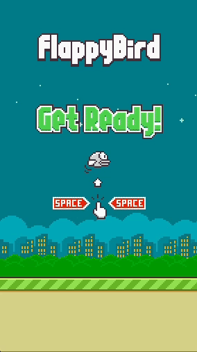

# Pygame Flappy Bird Clone

## Table of Contents
- [Overview](#overview)
- [Installation](#installation)
- [Resources](#resources)

## Overview
This project is a simple clone of the popular Flappy Bird game, built using Python and Pygame. This captures all core mechanics of the original game.

<p align="center">
  
</p>

## Installation
Follow these steps to get the game up and running on your local machine:

1. **Prerequisites**\
    Make sure you have Python 3.x installed.

2. **Clone Repository**\
    Open your terminal and run the following:

    ```
    git clone https://github.com/CodeAndChill-YT/flappy-bird-clone.git
    ```

    ```
    cd flappy-bird-clone
    ```
   
3. **Set Up Virtual Environment (Optional)**\
   Although this project is simple, it is good practice to use a virtual environment. This will help reduce version complications between projects. In your terminal run:

    ```
    python3 -m venv venv
    ```

    Once created, activate the virtual environment using the commands below.

    macOS/Linux:
    ```
    source venv/bin/activate
    ```

    Windows:
    ```
    venv\Scripts\activate
    ```
4. **Install Dependencies**\
    With the virtual environment activated, install the necessary packages.
    ```
    pip install -r requirements.txt
    ```

5. **Launch Flappy Bird**\
    Once everything is set up, you can run ```main.py``` to launch Flappy Bird.
    ```
    python main.py
    ```

## Resources
- **YouTube**:  
View the raw programming of this project on the [Code and Chill](https://www.youtube.com/watch?v=Ccaka6NmZWM&t=15s) YouTube channel. Any feedback is greatly appreciated, and if you enjoy the video, make sure to subscribe!

- **Assets**:  
All assets used in this project were sourced from [flappy-bird-assets](https://github.com/samuelcust/flappy-bird-assets).

- **Pygame**:  
Find detailed information and tutorials on Pygame at [Pygame Docs](https://www.pygame.org/docs/).
